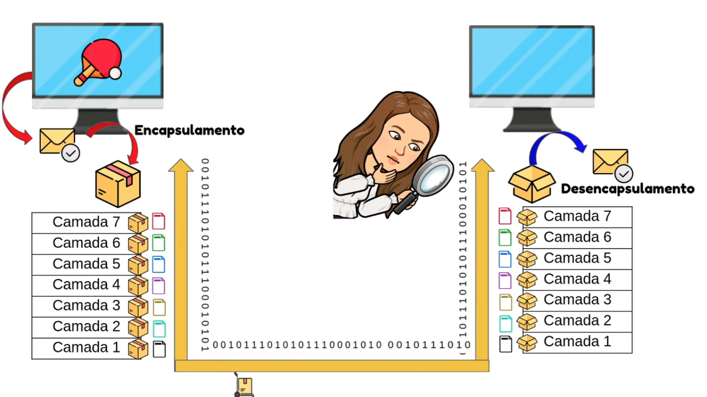
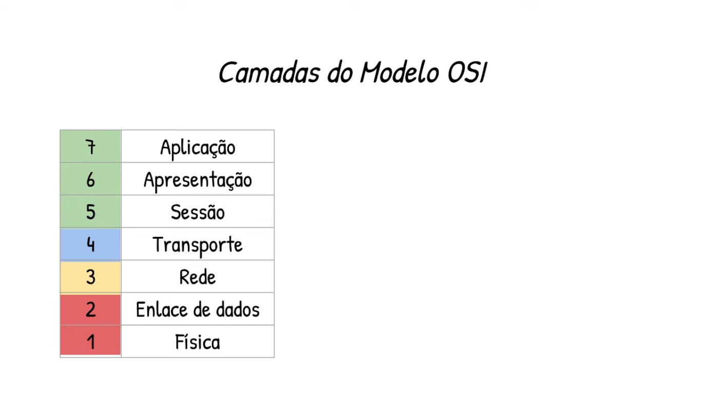
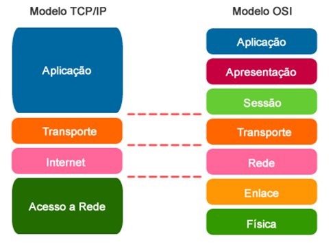

# Modelo OSI (Open Systems Interconnection)

## Sobre

- O Modelo OSI é um modelo conceitual.
- Define regras de como dois dispositivos abertos devem se comunicar da melhor forma.
- O Modelo TCP/IP é a implementação do Modelo OSI, mesmo ele tendo surgido antes.
- O Modelo OSI define 7 camadas e o Modelo TCP/IP (ou Pilha de Protocolos TCP/IP) define 4 camadas (ou 5 a depender do autor).

## Camada de Aplicação

- Disponibilização de serviços/clientes/aplicações/programas.
- Permite usar a comunicação em uma Rede.
- Navegador Web, Outlook, Plataforma de Filmes, Jogos, Vídeos ou Músicas.

## Camada de Apresentação

- Lida com as representações dos dados.
- Sintaxe e Semântica.
- Converte os dados para o formato que possa ser compreendido pelo receptor.
- Pode incluir a compressão e criptografia e descriptografia de dados.

## Camada de Sessão

- Vai estabelecer, gerenciar e encerrar sessões.
- Permite que os dispositivos troquem dados de forma sincronizadas.
- Analogia a uma ligação telefônica, existe uma sessão entre os dois telefones.

## Camada de Transporte

- Responsável pela transferência dos dados.
- A forma como transferir os dados.
- Vai percorrer o caminho estabelecido pela Camada de Rede, de forma a prover a confiabilidade na entrega.

## Camada de Rede

- Responsável pelo roteamento dos dados.
- Reconhece os Endereço Lógico (IP) dos dispositivos de Origem e Destino.
- Determina o melhor caminho através de algoritmos de roteamento.
- Analogia ao GPS.

## Camada de Enlace

- Responsável pela transmissão dos Quadros (Frames).
- Transforma a Camada Física em um link confiável.
- Entrega __nó a nó__ ou entrega __fim a fim__, uma informação sair e chegar em outro ponto exatamente do mesmo jeito.

## Camada Física

- Responsável pela transmissão dos BITS entre dois dispositivos.
- Os BITS são convertidos em sinais elétricos ou ópticos.
- Conexão Guiada ou Conexão Não Guiada.
